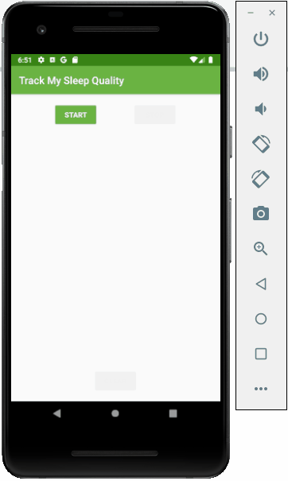

# Sleep Tracker RV

An Android application that uses a RecyclerView to track and display the user's sleep quality.

Submitted by: Brianna Magnuson

Time spent: 3 days

## User Stories

The following **required** functionality is complete:

* [x] Replace ScrollView with RecyclerView.
* [x] Create RecyclerView adapter and ViewHolder for data binding.
* [x] Display sleep quality list by using recycled ViewHolders.
* [x] Display sleep quality list using icons instead of text.

The following **additional** features are implemented:

* [ ] List anything else that you can get done to improve the app functionality!

## Video Walkthrough 

Here's a walkthrough of implemented user stories:

## Notes

Describe any challenges encountered while building the app.

I had quite a few challenges while working on this app. I originally tried my code from the previous version of this app, 
and something just wasn't working. I believe it was an unresolved variable issue, but I'm not sure where that variable would
have to have been placed. I tried using the provided starter code and everything went smoothly from there.

## License

Copyright 2019 Brianna Magnuson

Licensed under the Apache License, Version 2.0 (the "License");
you may not use this file except in compliance with the License.
You may obtain a copy of the License at

http://www.apache.org/licenses/LICENSE-2.0

Unless required by applicable law or agreed to in writing, software
distributed under the License is distributed on an "AS IS" BASIS,
WITHOUT WARRANTIES OR CONDITIONS OF ANY KIND, either express or implied.
See the License for the specific language governing permissions and
limitations under the License.
